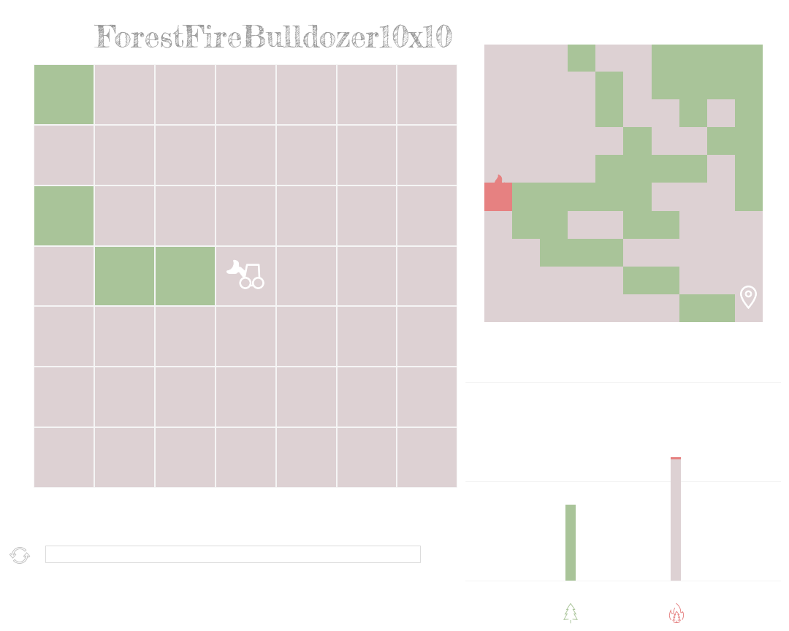

# Bulldozer RL Training with Stable Baselines

In this repository, we train instances of the Bulldozer reinforcement learning environment using Stable Baselines. Our work focuses on fixing bugs in the original Bulldozer environment repository. After experimenting with various reward functions, we found that the episodic function works best for solving small instances.

## Results

Below are some GIFs showing instances that have been successfully solved:

1.  Deep Reinforcement Learning Algorithm to solve the instance by creating a containment strategy:

1. 
2. 
3. 
   <!-- Add more GIFs as necessary -->

## Links

- [Moving Firefighter Problem (MFP)](https://www.mdpi.com/2038212)
- [MFP Repository](https://github.com/BrunoGupa/MovingFirefighterProblem)
- [Bulldozer Benchmark Repository](https://github.com/elbecerrasoto/gym-cellular-automata)
For translating instances from the Moving Firefighter Problem (MFP) into the Bulldozer RL environment, please refer to our instance translator available [here](https://github.com/BrunoGupa/instance_translator).
